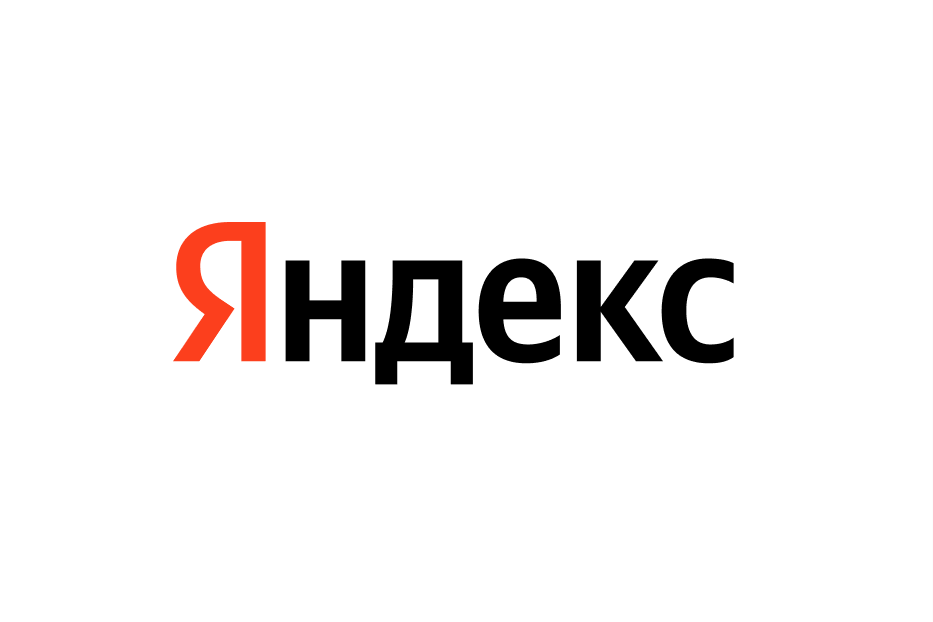

## Hi there 👋  

###  About Me:
- 🏫 I'm a HSE Lyceum student and a **Machine Learning / Deep Learning engineer**, with solid backend & fullstack experience  
  
- 🤖 My main focus right now is **Machine Learning**:
  - 📷 **Computer Vision** (object detection, classification, motion analysis)
  - 🧠 **NLP**
  - 📊 **Classical ML**
- 🚗 I work on **robotics projects** (autonomous navigation, lidar, CV-based scene understanding)
- 💻 I use daily: **.py**, **.ipynb**, **.go**, **.jsx**
- 🧪 I work with **PyTorch**, GPU, Jupyter, DataSpell
- 💬 Talk to me about ML, DL, CV, Golang, infrastructure, politics, history, pet projects 😺
- 👯 We can connect to play some games: minecraft, HD2, Civilization VI, chess — or whatever you want

---

  

---

### 🧠 ML stack:
- **PyTorch**, torchvision
- **scikit-learn** (classical ML, feature engineering, pipelines)
- **CatBoost** (tabular data, gradient boosting)
- Computer Vision (CNNs, image processing)
- NLP (tokenization, embeddings, transformers – basics & practice)
- Experimentation in **Jupyter Notebooks**

---

### 🏢 I'm a fan of:

      
      

