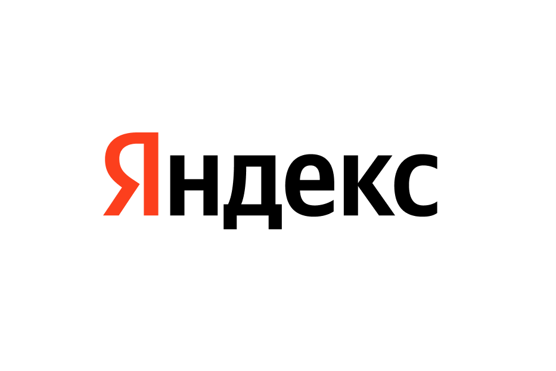

## Hi there 👋

###  About Me:
- 🏦 I'm a high school student and a fullstack developer both.. 
      
- 💻 I use daily: **.go**, **.py**, **.ipynb**,  **.sql**
- 💬 Talk to me about cricket, python (both of these are not any kind of insect or animals), Silicon Valley & startups
- 👯 We can connect to play some games: minecraft, HD2, Civilization 6, chess or whatever you want)
- 🧑‍💻 Tech I work on:

       
      
      
      
       
      
      
      
      
      
      
      
      
      

- 🏢 I'm fan of:

      
      

